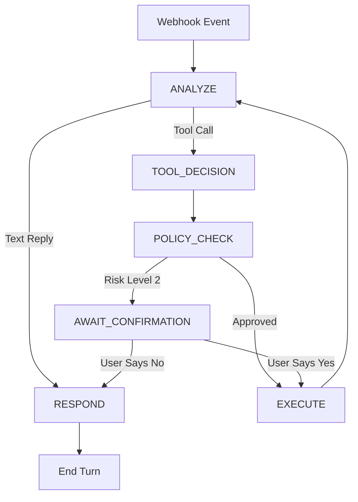

# Phase 1 Implementation Plan: The Kernel & Interface Specification

**Project:** The Headless Governor System  
**Phase:** 1 (The Kernel & Interface)  
**Version:** 1.0.0  
**Status:** READY FOR IMPLEMENTATION  
**Dependencies:** Phase 0 (Infrastructure) ✅ COMPLETED

## Executive Summary

Phase 1 focuses on building the **Control Plane** (The Governor) and the **Action Plane** (The Tools). We will implement the deterministic State Machine that manages the conversation flow, ensuring the AI doesn't just "chat" but actually "executes" tasks safely.

**Objective:** Deploy a working "Governor" that can receive a message via webhook, decide to run a tool (simulated), check permissions, and reply to the user.

## Architecture Overview

```
┌─────────────────────────────────────────────────────────────┐
│                    PHASE 1 ARCHITECTURE                     │
├─────────────────────────────────────────────────────────────┤
│                                                             │
│  ┌─────────────┐    ┌──────────────────┐    ┌─────────────┐ │
│  │   Webhook   │───▶│   Governor       │───▶│   Response  │ │
│  │   Ingress   │    │   State Machine  │    │   Handler   │ │
│  │             │    │                  │    │             │ │
│  └─────────────┘    └──────────────────┘    └─────────────┘ │
│                              │                              │
│                              ▼                              │
│  ┌─────────────┐    ┌──────────────────┐    ┌─────────────┐ │
│  │   Context   │───▶│   LangGraph      │───▶│    Tool     │ │
│  │  Manager    │    │   Processor      │    │  Registry   │ │
│  │             │    │                  │    │             │ │
│  └─────────────┘    └──────────────────┘    └─────────────┘ │
│                              │                              │
│                              ▼                              │
│                    ┌──────────────────┐                     │
│                    │   Policy Engine  │                     │
│                    │   (Security)     │                     │
│                    │                  │                     │
│                    └──────────────────┘                     │
└─────────────────────────────────────────────────────────────┘
```

## Implementation Steps

### Step 1: Core Domain Models (`src/core/domain/`)

**Goal**: Define the fundamental data structures that power the entire system.

**Priority**: CRITICAL - All other components depend on these models.

**Key Components**:

#### 1.1 Event Models
```python
# File: src/core/domain/events.py

class GovernorEvent:
    """Normalized input from all channels (Telegram, WhatsApp, Voice)"""
    user_id: str
    session_id: str  
    message_type: MessageType
    content: str
    metadata: dict
    timestamp: datetime
    channel: ChannelType
    
class GovernorResponse:
    """Structured output to be sent back to user"""
    user_id: str
    session_id: str
    content: str
    response_type: ResponseType
    metadata: dict
```

#### 1.2 State Models
```python
# File: src/core/domain/state.py

class GovernorState:
    """Current state of the conversation flow"""
    current_node: StateNode
    user_id: str
    session_id: str
    context: dict
    pending_tools: List[ToolCall]
    awaiting_confirmation: bool
    conversation_history: List[dict]
    
class StateNode(Enum):
    IDLE = "idle"
    ANALYZE = "analyze"
    TOOL_DECISION = "tool_decision"
    POLICY_CHECK = "policy_check"
    EXECUTE = "execute"
    AWAIT_CONFIRMATION = "await_confirmation"
    RESPOND = "respond"
```

#### 1.3 Tool Models
```python
# File: src/core/domain/tools.py

class ToolCall:
    """Structured tool execution request"""  
    tool_name: str
    arguments: dict
    risk_level: RiskLevel
    requires_confirmation: bool
    execution_id: str
    
class RiskLevel(Enum):
    SAFE = "safe"           # Auto-approve
    SENSITIVE = "sensitive" # Log but approve
    DANGEROUS = "dangerous" # Require confirmation
    
class PolicyDecision:
    """Result of policy engine assessment"""
    decision: DecisionType
    risk_score: float
    reasoning: str
    tool_call: ToolCall
```

**Implementation Tasks**:
- [ ] Create domain model files with Pydantic BaseModel classes
- [ ] Add comprehensive type hints and validation
- [ ] Create unit tests for all domain models
- [ ] Add serialization/deserialization methods

---

### Step 2: LangGraph State Machine (`src/governor/state_machine/`)

**Goal**: Implement the 7-state deterministic flow controller using LangGraph.

**Critical Principle**: The LLM is NOT the controller; the Graph is the controller.

#### 2.1 State Machine Design

**States (Nodes)**:
1. **`IDLE`**: System sleeping. Triggered by incoming Event.
2. **`ANALYZE`**: The "Context Manager" builds the prompt. LLM decides: "Talk" or "Act"?
3. **`TOOL_DECISION`**: If "Act", identify the tool and parameters.
4. **`POLICY_CHECK`**: **(Critical)** Intercepts the tool call. Checks Risk Score.
   - *Pass:* → `EXECUTE`
   - *Fail/High Risk:* → `AWAIT_CONFIRMATION`
5. **`EXECUTE`**: Runs the Python function from the Tool Registry.
6. **`AWAIT_CONFIRMATION`**: Pauses execution. Sends "Do you want to proceed?" to user.
7. **`RESPOND`**: Formulates final response to user.

#### 2.2 Graph Flow



#### 2.3 Implementation Structure

```python
# File: src/governor/state_machine/graph.py

class GovernorGraph:
    """Main LangGraph implementation"""
    
    def __init__(self):
        self.graph = self._build_graph()
        
    def _build_graph(self) -> StateGraph:
        workflow = StateGraph(GovernorState)
        
        # Add nodes
        workflow.add_node("idle", self.idle_handler)
        workflow.add_node("analyze", self.analyze_handler)
        workflow.add_node("tool_decision", self.tool_decision_handler)
        workflow.add_node("policy_check", self.policy_check_handler)
        workflow.add_node("execute", self.execute_handler)
        workflow.add_node("await_confirmation", self.await_confirmation_handler)
        workflow.add_node("respond", self.respond_handler)
        
        # Add edges with conditional routing
        workflow.add_edge(START, "analyze")
        workflow.add_conditional_edges("analyze", self.analyze_router)
        # ... more edges
        
        return workflow.compile()
```

**Implementation Tasks**:
- [ ] Create LangGraph workflow definition
- [ ] Implement all 7 state handlers
- [ ] Add conditional routing logic
- [ ] Create state persistence mechanism
- [ ] Add comprehensive integration tests

---

### Step 3: Tool Registry & Policy Engine (`src/action_plane/`)

**Goal**: Secure, declarative tool management with automatic risk assessment.

#### 3.1 Tool Registry Decorator (`src/action_plane/tool_registry/`)

```python
# File: src/action_plane/tool_registry/decorator.py

@governor_tool(
    name="get_weather",
    description="Get current weather for a location",
    risk_level=RiskLevel.SAFE,
    args_schema=WeatherSchema
)
def get_weather(location: str) -> dict:
    """Safe tool - auto-approved"""
    return {"weather": "sunny", "temp": 72, "location": location}

@governor_tool(
    name="send_email", 
    description="Send email to recipient",
    risk_level=RiskLevel.DANGEROUS,
    args_schema=EmailSchema
)
def send_email(recipient: str, body: str) -> dict:
    """Dangerous tool - requires confirmation"""
    # Real SMTP implementation
    return {"status": "sent", "recipient": recipient}
```

#### 3.2 Policy Engine (`src/action_plane/policy_engine/`)

**The "Firewall" Logic**:
- IF `risk_level == SAFE`: Return `ALLOWED`
- IF `risk_level == SENSITIVE`: Return `ALLOWED` + Log
- IF `risk_level == DANGEROUS`: Return `REQUIRES_CONFIRMATION`

```python
# File: src/action_plane/policy_engine/engine.py

class PolicyEngine:
    """Security firewall for tool execution"""
    
    def evaluate_tool_call(self, tool_call: ToolCall, user_context: dict) -> PolicyDecision:
        """Evaluate whether a tool call should be allowed"""
        
        if tool_call.risk_level == RiskLevel.SAFE:
            return PolicyDecision(
                decision=DecisionType.ALLOW,
                risk_score=0.1,
                reasoning="Safe tool, auto-approved"
            )
        elif tool_call.risk_level == RiskLevel.DANGEROUS:
            return PolicyDecision(
                decision=DecisionType.REQUIRE_CONFIRMATION,
                risk_score=0.9,
                reasoning="High-risk tool requires user confirmation"
            )
```

**Implementation Tasks**:
- [ ] Create @governor_tool decorator with registration
- [ ] Implement tool registry with discovery mechanism
- [ ] Build policy engine with risk assessment
- [ ] Add tool argument validation with Pydantic
- [ ] Create example tools for testing

---

### Step 4: Context Manager (`src/governor/context/`)

**Goal**: Dynamic prompt assembly with mock data for Phase 1.

#### 4.1 Context Assembly Formula

`Prompt = Persona + Environment + Memory + Tasks`

```python
# File: src/governor/context/assembler.py

class ContextAssembler:
    """Dynamic system prompt construction"""
    
    def assemble_context(self, user_id: str, current_input: str, state: GovernorState) -> str:
        """Assemble system prompt from multiple sources"""
        
        persona = self._get_persona(user_id)
        environment = self._get_environment_context(user_id)  # Mock in Phase 1
        memory = self._get_memory_context(user_id, current_input)  # Mock in Phase 1
        tasks = self._get_active_tasks(user_id)  # Mock in Phase 1
        
        return f"""
{persona}

ENVIRONMENT CONTEXT:
{environment}

MEMORY CONTEXT:
{memory}

ACTIVE TASKS:
{tasks}

Current user input: {current_input}
Current state: {state.current_node}
"""
```

#### 4.2 Phase 1 Mock Data

- **Persona**: Static personality instructions
- **Environment**: Mock time/location data
- **Memory**: Mock conversation history
- **Tasks**: Mock active processes

**Implementation Tasks**:
- [ ] Create ContextAssembler class
- [ ] Implement prompt template system
- [ ] Add mock data providers for Phase 1
- [ ] Create context caching mechanism
- [ ] Add unit tests for prompt generation

---

### Step 5: Webhook Interface (`src/interfaces/webhooks/`)

**Goal**: Unified ingress for all communication channels.

#### 5.1 Unified Ingress Endpoint

```python
# File: src/interfaces/webhooks/ingress.py

@app.post("/webhook/ingress")
async def webhook_ingress(
    request: Request,
    background_tasks: BackgroundTasks
) -> dict:
    """Generic webhook ingress for all channels"""
    
    # Parse raw payload
    payload = await request.json()
    
    # Normalize to GovernorEvent
    event = await normalize_payload(payload, request.headers)
    
    # Return 200 OK immediately
    background_tasks.add_task(process_governor_event, event)
    
    return {"status": "received", "event_id": event.session_id}

async def process_governor_event(event: GovernorEvent):
    """Process event through Governor state machine"""
    
    # Initialize or restore state
    state = await get_or_create_state(event.user_id)
    
    # Run through LangGraph
    result = await governor_graph.arun(state, event)
    
    # Send response back to user
    await send_response(result.response)
```

**Implementation Tasks**:
- [ ] Create generic webhook endpoint
- [ ] Implement payload normalization
- [ ] Add background task processing
- [ ] Create response delivery mechanism
- [ ] Add webhook authentication/security

---

## Implementation Timeline

### Phase 1.1: Foundation (Week 1)
- [ ] **Domain Models** - Core data structures
- [ ] **Basic Context Manager** - Mock implementation
- [ ] **Tool Registry Decorator** - Basic registration

### Phase 1.2: Core Logic (Week 2)
- [ ] **LangGraph State Machine** - Full 7-state implementation
- [ ] **Policy Engine** - Risk assessment logic
- [ ] **Tool Execution** - Safe execution framework

### Phase 1.3: Integration (Week 3)
- [ ] **Webhook Interface** - Unified ingress
- [ ] **End-to-End Testing** - Full flow validation
- [ ] **Documentation** - API docs and usage guides

## Success Criteria

**Phase 1 is complete when:**

✅ **Basic Flow**: Webhook → State Machine → Tool → Response  
✅ **Security**: High-risk tools trigger confirmation flow  
✅ **Logging**: All interactions structured and logged  
✅ **Performance**: Sub-500ms latency for simple requests  
✅ **Testing**: 90%+ test coverage on core components  

## Testing Strategy

### Unit Tests
- Domain models validation
- State machine node handlers
- Tool registration and validation
- Policy engine decisions
- Context assembly logic

### Integration Tests
- Full state machine flow
- Webhook to response pipeline
- Tool execution with policy checks
- Error handling and recovery

### End-to-End Tests
- Real webhook payload processing
- Complete conversation flows
- Security confirmation flows
- Performance benchmarks

## Risk Mitigation

**High Risk**: LangGraph complexity
- *Mitigation*: Start with simple linear flow, add complexity gradually
- *Fallback*: Direct function calls if LangGraph proves problematic

**Medium Risk**: Tool security
- *Mitigation*: Conservative policy engine, extensive testing
- *Fallback*: All tools require confirmation initially

**Low Risk**: Performance
- *Mitigation*: Async processing, caching, monitoring
- *Fallback*: Optimize bottlenecks as identified

## Phase 2 Preparation

Phase 1 establishes the foundation for Phase 2's memory hierarchy:

- **Domain models** will be extended for memory storage
- **State machine** will integrate with real memory systems  
- **Context manager** will replace mocks with actual RAG++ retrieval
- **Tool registry** will expand with real external API integrations

---

**Next Steps**: Begin with **Step 1: Core Domain Models** implementation.